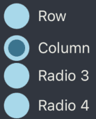

# sora-ui

Its just my personal UI

https://github.com/NobuyukiSora

## Installation

```sh
npm install sora-ui

yarn add sora-ui
```

## Components

<div style="
    background-color: #6B7C8E; 
    border-radius: 10px; 
    display: flex; 
    justify-content: center; 
    align-items: center;
    padding: 16px"
>
    <table>
    <tr>
        <td>Name</td>
        <td>Image</td>
        <td>Desciption</td>
    </tr>
    <tr>
        <td>Button</td>
        <td></td>
        <td></td>
    </tr>
    <tr>
        <td>CheckBox</td>
        <td></td>
        <td>can change the icon using the child</td>
    </tr>
    <tr>
        <td>Header</td>
        <td></td>
        <td>can change the icon using the child</td>
    </tr>
    <tr>
        <td>RadioButton</td>
        <td></td>
        <td>can change the icon using the child</td>
    </tr>
    <tr>
        <td>TextInputFiled</td>
        <td></td>
        <td></td>
    </tr>
    <tr>
        <td>Typograph</td>
        <td></td>
        <td></td>
    </tr>
    </table>
</div>

---
---

## Tools

<div style="
background-color: #6B7C8E; 
border-radius: 10px; 
display: flex; 
justify-content: center; 
align-items: center;
padding: 20px;">
    <table>
    <tr>
        <td>Name</td>
        <td>Usage</td>
    </tr>
    <tr>
        <td>themeManagement</td>
        <td>change theme: [Dark, Light, Same as system]</td>
    </tr>
    <tr>
        <td>metrics</td>
        <td>measurements</td>
    </tr>
    <tr>
        <td>colors</td>
        <td>color list by default</td>
    </tr>
    </table>
</div>

## Contributing

See the [contributing guide](CONTRIBUTING.md) to learn how to contribute to the repository and the development workflow.

## License

MIT

---

Made with [create-react-native-library](https://github.com/callstack/react-native-builder-bob)
