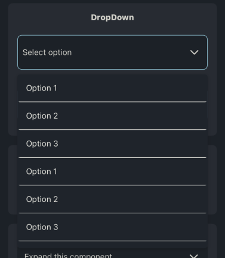

# sora-ui

A streamlined and professional personal UI library.

- **GitHub Repository**: [Sora-UI on GitHub](https://github.com/NobuyukiSora/SorasUI)
- **Documentation**: [Explore Sora-UI Components](https://jessen.netlify.app/SorasUI)

## Installation

To get started, install Sora-UI and its dependencies using npm or yarn:

```sh
npm install sora-ui @react-native-async-storage/async-storage react-native-reanimated

yarn add sora-ui @react-native-async-storage/async-storage react-native-reanimated
```

## Components

<div style="
    background-color: #6B7C8E; 
    border-radius: 10px; 
    display: flex; 
    justify-content: center; 
    align-items: center;
    padding: 16px"
>
    <table>
    <tr>
        <td>Name</td>
        <td>Image</td>
        <td>Desciption</td>
    </tr>
    <tr>
        <td>Button</td>
        <td></td>
        <td>a reusable UI element that provides a customizable button with various styling options. It supports different variants, sizes, and event handling, making it flexible for different use cases.</td>
    </tr>
    <tr>
        <td>Calendar</td>
        <td></td>
        <td>component provides an interactive date selection interface. It allows users to pick a date, navigate between months, and customize the appearance. It is designed to be lightweight, flexible, and easily integrated into different parts of an application.</td>
    </tr>
    <tr>
        <td>Carousel</td>
        <td></td>
        <td>a horizontally scrollable component that displays multiple items, one at a time or in a loop. It supports smooth animations, auto-scrolling, and gesture-based swiping. This component is useful for displaying images, product cards, testimonials, or any other content in a visually appealing manner.</td>
    </tr>
    <tr>
        <td>CheckBox</td>
        <td></td>
        <td>a simple UI element that allows users to toggle between checked and unchecked states. It is commonly used in forms, settings, and multi-select lists. This component supports custom styling, labels, and controlled/uncontrolled states.</td>
    </tr>
    <tr>
        <td>DonutChart</td>
        <td></td>
        <td>a circular chart that represents data as proportional slices of a donut. It is commonly used to visualize percentages, spending breakdowns, or progress indicators. This component supports custom colors, animations, labels, and dynamic data updates.</td>
    </tr>
    <tr>
        <td>DonutChart</td>
        <td></td>
        <td>a UI component that allows users to select an option from a list and calendar. When clicked or tapped, it expands to show multiple choices and collapses after a selection is made.</td>
    </tr>
    <tr>
        <td>DynamicScrollView</td>
        <td></td>
        <td>this component can help you to wrap the content inside</td>
    </tr>
    <tr>
        <td>Expandable View</td>
        <td></td>
        <td>an component that can expand, to show more data to display</td>
    </tr>
    <tr>
        <td>Header</td>
        <td></td>
        <td>an component that used for show back and title of the page or screen</td>
    </tr>
    <tr>
        <td>RadioButton</td>
        <td></td>
        <td>this component that allows users to select one option from a predefined set of choices.</td>
    </tr>
    <tr>
        <td>Rating</td>
        <td></td>
        <td>this have 2 mode, input mode that user can do input rating, and display mode to display the rating, and you can customize the icon</td>
    </tr>
    <tr>
        <td>Skeleton Loader</td>
        <td></td>
        <td>a UI placeholder that mimics the layout of actual content while it's loading</td>
    </tr>
    <tr>
        <td>SnackBar</td>
        <td></td>
        <td>You can run the snackbar using trigger, customize using setSnackBarType and setSnackBarTitle from useTrigger()
        </td>
    </tr>
     <tr>
        <td>Switch</td>
        <td></td>
        <td>you can add icon using icon command</td>
    </tr>
    <tr>
        <td>TextInputFiled</td>
        <td></td>
        <td></td>
    </tr>
    <tr>
        <td>TextInputSingleBox</td>
        <td></td>
        <td>An text input that used for input character 1 by 1 each box</td>
    </tr>
    <tr>
        <td>Typograph</td>
        <td></td>
        <td>a text component that can follow the theme</td>
    </tr>
    </table>
</div>

---

---

## Tools

<div style="
background-color: #6B7C8E; 
border-radius: 10px; 
display: flex; 
justify-content: center; 
align-items: center;
padding: 20px;">
    <table>
    <tr>
        <td>Name</td>
        <td>Usage</td>
    </tr>
    <tr>
        <td>themeManagement</td>
        <td>change theme: [Dark, Light, or Same as system]</td>
    </tr>
    <tr>
        <td>metrics</td>
        <td>measurements</td>
    </tr>
    <tr>
        <td>colors</td>
        <td>color list by default</td>
    </tr>
    </table>
</div>

## Contributing

See the [contributing guide](CONTRIBUTING.md) to learn how to contribute to the repository and the development workflow.

## License

MIT

---

Made with [create-react-native-library](https://github.com/callstack/react-native-builder-bob)
